 

I build tooling for AI agents and Minecraft mods, mostly in Python, TypeScript and Java. Self-taught. Most of what's here started as something I wanted for myself and got out of hand (the AI engineering vault was supposed to be a few notes, it's 660 now).

 

- [Git-Kitchen](https://github.com/DizzyMii/Git-Kitchen): Overcooked-themed multiplayer game for teaching testers git and PR hygiene
- [TestWeave](https://github.com/DizzyMii/TestWeave): drag-and-drop blocks in, Playwright / Selenium / Cypress / Puppeteer tests out
- [Resilient-Locator-Extractor](https://github.com/DizzyMii/Resilient-Locator-Extractor): CLI + Chrome extension that ranks selectors by how likely they are to survive DOM changes

 

  
<picture>
  <source media="(prefers-color-scheme: dark)" srcset="https://raw.githubusercontent.com/DizzyMii/DizzyMii/output/github-contribution-grid-snake-dark.svg" />
  <source media="(prefers-color-scheme: light)" srcset="https://raw.githubusercontent.com/DizzyMii/DizzyMii/output/github-contribution-grid-snake.svg" />
  
</picture>

