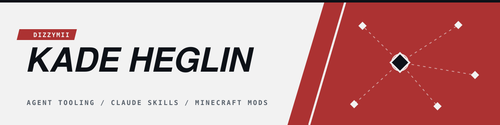

 

I build tooling for AI agents and Minecraft mods, mostly in Python, TypeScript and Java. Self-taught. Most of what's here started as something I wanted for myself and got out of hand (the AI engineering vault was supposed to be a few notes, it's 660 now).

## Agents

- **fable-skills**: six Claude Code skills that push Opus 4.8 toward Fable 5 behavior (what it claims, when it stops, what it touches). Every one was pressure-tested on real Opus subagents until the failure flipped, and the transcripts are in the repo
- **landlord**: MCP server that splits one task into parallel Claude Agent SDK sessions, each bound to a contract with JSON Schema checkpoints. Tenants that break contract get evicted and retried. Runs on a Pro/Max sub, ~1,200 lines, 52 tests
- **Flint**: TypeScript agent runtime, six primitives and one runtime dependency, errors come back as values ([docs](https://dizzymii.github.io/Flint/))
- **ai-engineering-brain**: ~660 linked Obsidian notes from floating point up to inference economics, every applied claim tagged with an evidence tier, a source and a date

## Smaller stuff

- [Git-Kitchen](https://github.com/DizzyMii/Git-Kitchen): Overcooked-themed multiplayer game for teaching testers git and PR hygiene
- [TestWeave](https://github.com/DizzyMii/TestWeave): drag-and-drop blocks in, Playwright / Selenium / Cypress / Puppeteer tests out
- [Resilient-Locator-Extractor](https://github.com/DizzyMii/Resilient-Locator-Extractor): CLI + Chrome extension that ranks selectors by how likely they are to survive DOM changes

## Stack

  
NeoForge 1.21.1 · MCP · Claude Agent SDK · Aseprite · Blockbench

## Stats

  

  

  
<picture>
  <source media="(prefers-color-scheme: dark)" srcset="https://raw.githubusercontent.com/DizzyMii/DizzyMii/output/github-contribution-grid-snake-dark.svg" />
  <source media="(prefers-color-scheme: light)" srcset="https://raw.githubusercontent.com/DizzyMii/DizzyMii/output/github-contribution-grid-snake.svg" />
  
</picture>

